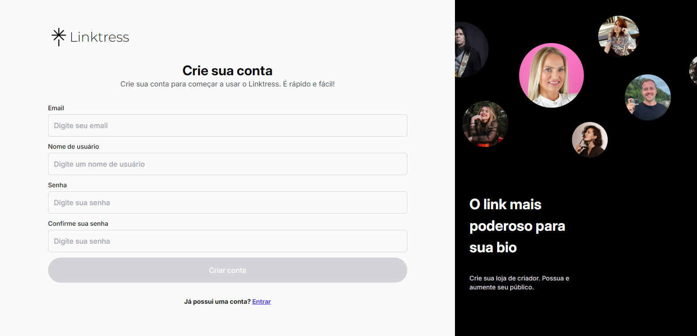

# Linktress

Este projeto é inspirado no [Linktree](https://linktr.ee/s/join-linktree-pro-for-free-ga?gclsrc=aw.ds&&utm_source=google&gad_source=1&gad_campaignid=21100095779&gbraid=0AAAAAoKs0uvyk2dmK9glYUML-oRkNrYsM&utm_medium=cpc&utm_campaign=21100095779&utm_term=linktree&utm_content=162662017569&device=c&matchtype=e&network=g&placement&gclid=CjwKCAjw6NrBBhB6EiwAvnT_rgvJgXRwwsu-kpjLG3TPCnCNQ7CnjiwX9OmJOkl2BtX2C3aWQXftJhoCUggQAvD_BwE&gclsrc=aw.ds) e foi desenvolvido para fins de aprendizado.

### O projeto consiste principalmente nas seguintes funcionalidades:

- Cadastro/Login de Usuário – Autenticação com e-mail/senha utilizando o Firebase.
- Criação de Perfil Personalizado – Nome, bio, upload de imagem de perfil e tema visual.
- Gerenciamento de Links – Adição, e exclusão de múltiplos links.
- Página Pública Responsiva – Geração de uma URL única com os links do usuário.
- Painel Admin/Usuário – Interface para gerenciar o perfil.

- Site: [https://linktress-pied.vercel.app/](https://linktress-pied.vercel.app/)

### Tecnologias utilizadas 💻

- Vite
- React
- Typescript
- Tailwind
- Firebase
- Gerenciamento de estado usando o context-api

### 🙋 Autor

- **Portfólio:** [Gabriel Moura Dev](https://portfolio-gabrieldev.vercel.app/)
- **Linkedin:** [Gabriel Moura](https://www.linkedin.com/in/gabriel-moura-b63382161/)
